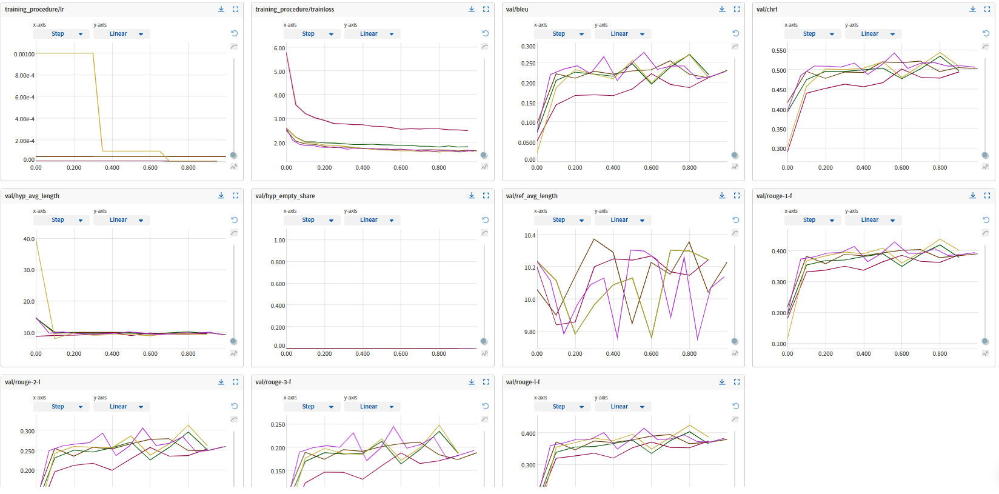

# AbstractSummarization
NLP проект про суммаризацию.

Основная задача: научиться генерировать заголовки статей по их аннотациям. В качестве обучающего датасета были выбраны заголовки и аннотации выпускных квалификационных работ студентов НИУ ВШЭ.

Проект условно можно разделить на четыре основных части:
1. Сбор и обработка данных
2. Осмотр данных
3. Обучение моделей
4. Выкладка лучшей модели в *продакшн* и разработка веб-приложения

## Сбор и обработка данных
НИУ ВШЭ публикует краткую информацию о работе каждого студента на сайте - www.hse.ru/edu/vkr. 

Данные я собирал асинхронно (asyncio, aiohttp), с помощью парсера из [parsing/parser.py](parsing/parser.py). Было выгружено 73 тысячи записей, вся процедура заняла \~60 минут.

Собранные курсовые я очищал от пропусков, тэгов, табов, переносов строк и пустых строк. После удаления записей с отсутствующими аннотациями в датасете осталось 69 тысяч наблюдений, после удаления слишком коротких аннотаций - 66 тысяч, после фильтрации по языку (оставлял только русский) - 65 тысяч.

[Ноутбук парсинг данных](https://colab.research.google.com/drive/1HhptktsglrPZ-gTdaDmcOfd8jM933zuK)

[Ноутбук предобработка данных](https://colab.research.google.com/drive/1oIpHwZv_5Z4ARI-MbuCbt6j4fCSIgJsw)
## Осмотр данных
Провел небольшой обзор данных. Из интересного:
1. Среднее число слов в заголовке - 9
2. Среднее число слов в аннотации - 150
3. Среднее отношение слов в заголовке к словам в аннотации - 0.06
4. 2018 год - единственный год, когда количество работ не выросло. Полагаю, что это связано с политическим кризисом 2014 года (отложенный в 4 года эффект)
5. Больше всего в датасете ВКР студентов программ: экономика (4400), менеджмент (3500), юриспруденция (3500), бизнес-информатика (2500), дизайн (1400)

[Ноутбук EDA полученного датасета](https://colab.research.google.com/drive/1YkXKjw4-5CxDShISPwKttq03HxXEFzVQ)
## Обучение моделей
Для работы с моделями использовал библиотеки torch и transformers. Рассматривал модели: ruT5 (240M параметров), ruBERT (380M), ruGPT3 (355M). Классы-оболочки для них хранятся в [models](models/). Они инкапсулируют работу с токенизатором, генератором, forward и backward проходами.

Для обучения моделей и проведения экспериментов пользовался сервисом Datasphere. Вычисления проводились на устройстве g1.1 (NVIDIA Tesla V100) и занимали от 20 до 30 Gb видеопамяти. Для многократного повторения процедур обучения с разными параметрами использовал класс [mlexp/trainer.py](mlexp/trainer.py).

Оценивал модели по метрикам: BLEU, chrF, ROUGE-1-F, ROUGE-2-F, ROUGE-3-F, ROUGE-L-F. Реализованы в [util/metrics.py](util/metrics.py). Токенизировал предложения с помощью библиотеки razdel из nlp-проекта natasha - [util/tokenizator.py](util/tokenizator.py).

Результаты моделей на отложенной выборке:
| Model                     | BLEU | chrF | R-1-f | R-L-f  |
|:--------------------------|:------|:------|:------|:------|
| ruT5         | 24.3  | 52.1  | 40.9  | 39.4     |
| ruBERT             | 20.3  | 49.7  | 37.8  | 36.4    |
| ruGPT3                | 3.5  | 33.6  | 22.1  | 21.1     |
| First Sentence            | 4.8  | 28.6  | 13.6  | 13.2     |

ruT5 лучше всего справляется с поставленной задачей, обладая при этом наименьшим числом параметров. Модель хорошо выучивает основные паттерны составления заголовков и воспроизводит их на тестовом датасете. ruBERT часто генерирует слишком общие заголовки, повторяет слова и пишет тавтологичные выражения. Это негативно сказывается на эффективности модели. ruGPT3 из-за особенностей архитектуры (decoder only) требует более длительного обучения. Она не показывает хороших результатов, т.к. часто генерирует общие фразы и излишне перефразирует исходный текст. 

Для логирования экспериментов пользовался библиотекой Neptune - [mlexp/logger.py](mlexp/logger.py). Логировал параметры модели и оптимизатора, значения метрик на обучающем, валидационном и тестовых датасетах. Суммарно провел более 70 экспериментов, их результаты описаны в [neptune/experiments.csv](neptune/experiments.csv).

Пример сравнения экспериментов в Neptune:

Пример работы модели:
> **Abstract**: Данная работа содержит многоаспектный анализ судебного усмотрения как правовой категории и выявление его практического отражения в правоприменительной деятельности в гражданском и арбитражном процессах. Рассматриваются три важнейшие проблемы усмотрения: понятие, виды и пределы дискреционных полномочий. Автор выдвигает и доказывает гипотезу о том, что усмотрение суда ограничено не только формальными рамками, но и руководящими принципами права, а также иными внешними пределами
>
> **Original title**: Усмотрение суда: теория и практика
>
> **ruT5**: Усмотрение суда в гражданском и арбитражном процессах

[Ноутбук обучения модели ruT5](https://colab.research.google.com/drive/1rgYv-oRuGJ_f1RtlFwa4kSERe8fZvQe2)

[Ноутбук обучения модели ruBERT](https://colab.research.google.com/drive/1otgZq1SOZZ_b3cpksHSk3tNzYNKuvEx9)

## Выкладка лучшей модели в *продакшн* и разработка веб-приложения
To be done...

Планирую оформить модель в Docker-контейнер на Датасфере и сделать веб-интерфейс на Django.

Кроме этого, хочу выложить модели в открытый доступ на Hugging Face.
